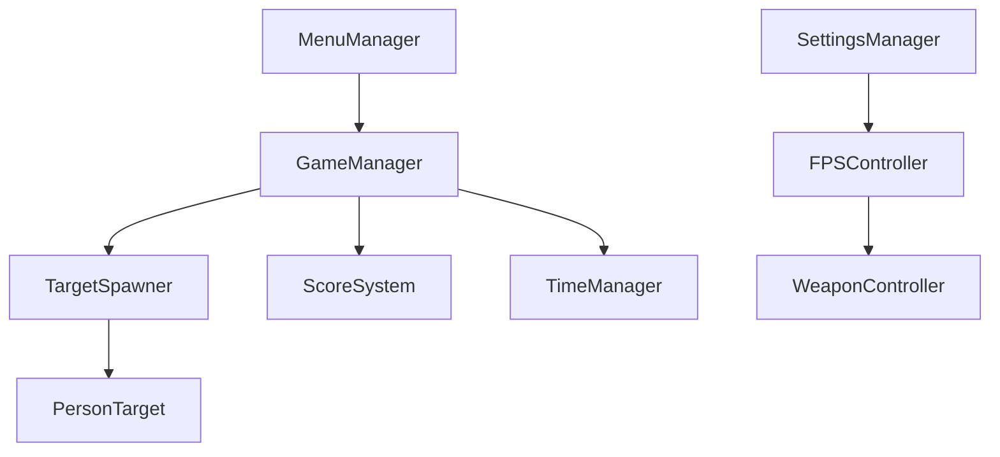

# Deadshot Protocol 🎯


  
  
  
  


  🎮 A Tactical First-Person Shooter Built with Unity
  Experience precision shooting with dynamic target spawning, headshot mechanics, and competitive scoring in this tactical FPS game.


***

## 📖 Table of Contents

- [🎯 Game Overview](#-game-overview)
- [✨ Features](#-features)
- [🎮 Controls](#-controls)
- [🚀 Getting Started](#-getting-started)
- [🛠️ Technical Details](#️-technical-details)
- [📁 Project Structure](#-project-structure)
- [🎨 Customization](#-customization)
- [📊 Performance](#-performance)
- [🐛 Known Issues](#-known-issues)
- [🤝 Contributing](#-contributing)
- [📄 License](#-license)

***

## 🎯 Game Overview

**Deadshot Protocol** is a precision-focused tactical first-person shooter that challenges players to achieve the highest score within a **60-second time limit**. The game features dynamic target spawning, realistic headshot mechanics, and a comprehensive scoring system designed for competitive gameplay and tactical precision.

### 🎪 Game Mechanics

- **⏱️ 60-Second Protocol**: Race against time to maximize your tactical score
- **🎯 Dynamic Target System**: Always maintains 3 person-shaped targets on the field
- **💥 Precision Headshot System**: Tactical shots reward higher points (Head: 50pts, Body: 25pts)
- **🔄 Instant Target Respawn**: Targets respawn immediately upon elimination
- **🏆 High Score Protocol**: Persistent tactical leaderboard system

***

## ✨ Features

### 🎮 Core Gameplay
| Feature | Description |
|---------|-------------|
| **Tactical Movement** | Smooth WASD movement with running, jumping, and precision mouse look |
| **Precision Shooting** | Military-grade raycast hit detection with visual feedback |
| **Target Variety** | Person-shaped tactical targets with distinct head and body hitboxes |
| **Real-time Scoring** | Instant point calculation with tactical hit indicators |
| **Protocol Timer** | 60-second tactical rounds with immediate feedback |

### 🎨 Visual & Audio
- **🎵 Procedural Audio**: Dynamically generated tactical sound effects for shooting and reloading
- **💥 Combat Effects**: Muzzle flash and impact visualization
- **🎨 Material System**: Customizable target and environment materials
- **📱 Tactical HUD**: Clean interface with real-time tactical statistics

### ⚙️ User Experience
- **🖱️ Precision Sensitivity**: In-game mouse sensitivity adjustment (10-500 range)
- **⏸️ Mission Control**: Full pause functionality with menu navigation
- **💾 Protocol Storage**: Automatic save/load of user preferences
- **📊 Performance Monitoring**: Real-time FPS and system statistics

***

## 🎮 Controls

### 🖱️ **Tactical Controls**
```
🖱️ Mouse Movement    → Precision Aiming (Customizable Sensitivity)
🖱️ Left Click       → Fire Weapon
⌨️  W A S D          → Tactical Movement
⌨️  Left Shift       → Sprint
⌨️  Space            → Jump
⌨️  R                → Reload
⌨️  TAB              → Settings Protocol
⌨️  ESC              → Mission Pause
```

### 🎯 **Scoring Protocol**
- 🎯 **Headshot**: 50 Points + "HEADSHOT!" confirmation
- 👤 **Body Shot**: 25 Points + "BODYSHOT" confirmation
- 🏆 **Protocol Record**: Automatically saved and displayed

***

## 🚀 Getting Started

### 📋 **Mission Requirements**
- **Unity 2021.3 LTS** or higher
- **Windows 10/11** (Primary platform)
- **DirectX 11** compatible graphics card
- **Minimum 2GB RAM**

### 🔧 **Deployment**

1. **Clone the Protocol**
   ```bash
   git clone https://github.com/yourusername/deadshot-protocol.git
   cd deadshot-protocol
   ```

2. **Initialize in Unity**
   - Launch Unity Hub
   - Click "Open Project"
   - Navigate to the cloned folder
   - Select the project

3. **Build Configuration**
   - Go to `File → Build Settings`
   - Ensure both scenes are added:
     - `MainMenu` (Index 0)
     - `GameScene` (Index 1)
   - Select your target platform
   - Click "Build and Run"

### 🏃♂️ **Quick Deployment**
1. Launch Deadshot Protocol
2. Click "PLAY GAME" from the tactical menu
3. Use mouse for precision aiming, left-click to engage
4. Execute the protocol - achieve highest score in 60 seconds!
5. Press TAB to configure sensitivity for optimal precision

***

## 🛠️ Technical Details

### 🏗️ **Protocol Architecture**

The game follows a **tactical modular architecture** with clear separation of concerns:



### 💻 **Core Protocol Components**

| Script | Purpose | Key Features |
|--------|---------|--------------|
| **GameManager.cs** | Mission control | Timer, scoring, pause system, scene transitions |
| **FPSController.cs** | Agent movement | WASD movement, mouse look, physics-based jumping |
| **WeaponController.cs** | Weapon systems | Raycast shooting, reload system, audio integration |
| **TargetSpawner.cs** | Target deployment | Dynamic spawning, distance checking, cleanup |
| **PersonTarget.cs** | Target behavior | Health system, hit detection, spawner communication |
| **SettingsManager.cs** | Agent preferences | Sensitivity settings, persistent storage |
| **MenuManager.cs** | Interface control | Scene management, menu interactions |

### 🎯 **Target Protocol System**

The game features an intelligent tactical target management system:

```csharp
// Target Structure
PersonTarget (Root)
├── Head (Sphere) - Tag: "Head" - 50 Points
└── Body (Cylinder) - Tag: "Body" - 25 Points
```

**Protocol Features:**
- **Always 3 Targets**: Maintains consistent tactical engagement
- **Smart Positioning**: Minimum 5-unit distance from agent
- **Instant Respawn**: New targets deploy immediately upon elimination
- **Random Distribution**: Targets spawn randomly within operational area

### 🔊 **Audio Protocol**

**Procedural Audio Generation:**
- No external audio files required
- Runtime sound synthesis for:
  - Weapon discharge effects (frequency-modulated)
  - Reload mechanics (tactical clicks)
  - Empty chamber indicators

***

## 📁 Project Structure

```
Deadshot-Protocol/
├── Assets/
│   ├── Scenes/
│   │   ├── MainMenu.unity          # Tactical menu scene
│   │   └── GameScene.unity         # Mission gameplay scene
│   ├── Scripts/
│   │   ├── GameManager.cs          # Core mission logic
│   │   ├── FPSController.cs        # Agent movement
│   │   ├── WeaponController.cs     # Weapon systems
│   │   ├── TargetSpawner.cs        # Target deployment
│   │   ├── PersonTarget.cs         # Target behavior
│   │   ├── SettingsManager.cs      # Agent settings
│   │   └── MenuManager.cs          # Menu navigation
│   ├── Prefabs/
│   │   └── PersonTarget.prefab     # Target prefab
│   ├── Materials/
│   │   ├── GroundMaterial.mat      # Ground texture
│   │   ├── WallMaterial.mat        # Wall texture
│   │   └── WeaponMaterial.mat      # Weapon texture
│   └── Textures/                   # Mission textures
├── ProjectSettings/                # Unity project settings
└── README.md                       # This file
```

***

## 🎨 Customization

### 🎯 **Target Protocol Modification**

Modify target appearance and tactical behavior:

```csharp
// In PersonTarget.cs - AdjustTargetHeight()
head.localPosition = new Vector3(0, 0.9f, 0);  // Adjust head height
body.localPosition = new Vector3(0, 0.1f, 0);  // Adjust body height

// In TargetSpawner.cs - Deployment settings
public int maxTargets = 3;                      // Change target count
public float minDistanceBetweenTargets = 3f;    // Adjust spacing
public Vector2 spawnAreaSize = new Vector2(8f, 8f); // Modify operational area
```

### ⚙️ **Precision Settings**

Customize tactical sensitivity ranges:

```csharp
// In SettingsManager.cs
public float defaultMouseSensitivity = 100f;    // Default precision
public float minSensitivity = 10f;              // Minimum allowed
public float maxSensitivity = 500f;             // Maximum allowed
```

### 🎮 **Mission Balance**

Adjust scoring and timing protocols:

```csharp
// In GameManager.cs
public float gameTime = 60f;                    // Mission duration

// In PersonTarget.cs - TakeDamage()
int points = isHeadshot ? 50 : 25;              // Point values
```

***

## 📊 Performance

### 🖥️ **System Requirements**

| Component | Minimum | Recommended |
|-----------|---------|-------------|
| **OS** | Windows 10 | Windows 11 |
| **CPU** | Intel i3 / AMD FX | Intel i5 / AMD Ryzen 5 |
| **Memory** | 2GB RAM | 4GB RAM |
| **Graphics** | DirectX 11 | Dedicated GPU |
| **Storage** | 100MB | 200MB |

### ⚡ **Performance Metrics**

- **Target FPS**: 60 FPS
- **Memory Usage**: ~50MB
- **Build Size**: ~25MB (Standalone)
- **Loading Time**: 

## 🙏 **Acknowledgments**

Special thanks to the Unity tactical community for tutorials and resources that made this protocol possible.

**Built with ⚡ precision using Unity Engine**

***

### 📞 **Protocol Contact & Support**

📧 **Email**: avishekdas4203@gmail.com  
🐙 **GitHub**: https://github.com/notavishek  
💬 **Discord**: https://discord.gg/6qmdZ2uC

***


